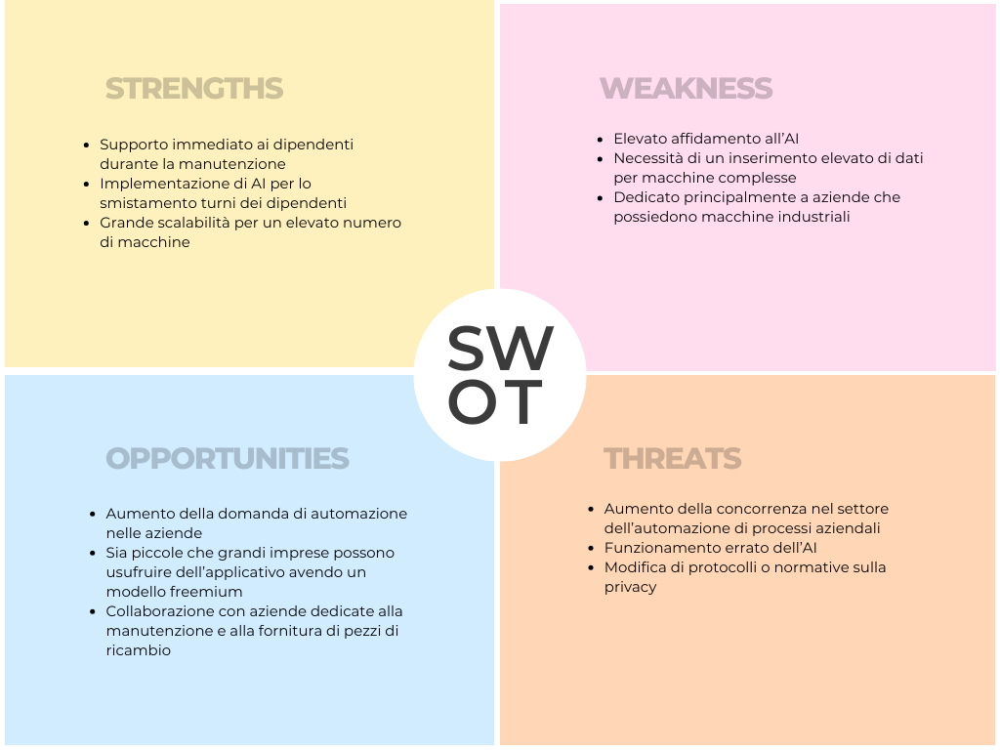

# TechPlanner
## Tagline
Applicativo per la gestione veloce e ottimale dei propri dipendenti 
## Descrizione
Gestionale per ottimizzare la distribuzione dei turni lavorativi dei dipendenti di un'azienda che necessita della revisione e manutenzione delle macchine industriali. Questo strumento ha l'obiettivo di migliorare l'efficienza operativa, garantire la corretta gestione delle risorse umane e facilitare la pianificazione delle attività di manutenzione, assicurando che ogni macchina riceva l'attenzione necessaria nei tempi stabiliti, sffuttando un algoritmo di inteligenza artifiiale per automatizzare il processo.
## Target 
Aziende che usufruiscono di diverse macchine per i processi lavoratrivi che necessitano di continui controlli
## Problema
Disorganizzazione e inefficienza nella gestione dei turni per la manutenzione delle macchine industriali
## Competitor 
I competitor del mio applicativo sono le varie app che permettono una gestione dei dipendenti, per esempio: 
1. SAP Field Service Management
2.  Skedulo
3.   ServiceMax
## Tecnologie
Le tecnologie che ho ritenuto gpiù ideonee alla creazione del progetto sono: 
*  MongoDB: per dati più flessibili e non strutturati, utile in applicazioni che richiedono elevata scalabilità.
*  JavaScript: utilizzato insieme a Node.js per il backend, e insieme ad HTML e CSS per il frontend
*  Python: per la creazione e addestramento di un inteligenza artificiale che permettta l'automatico smistamento dei turni dei dipendenti
## Requisiti
### Requisiti funzionali

- Accesso al sistema per dipendenti e responsabili d'azienda.
- Inserimento e aggiornamento dei dati personali da parte dei dipendenti.
- Visualizzazione e modifica degli orari tramite calendario integrato.
- Comunicazione tra utenti per facilitare la collaborazione.
- Monitoraggio dello stato delle macchine da remoto quando dispongono di IOT.
- Aggiunta e gestione di nuove macchine nel sistema.
- Inserimento dei protocolli per ogni nuova macchina inserita.
- Monitoraggio delle attività dei dipendenti da parte dei responsabili d'azienda.
- I dipendenti devono essere in grado di creare un report sulla manutenzione effettuata
- I dipendenti devono poter avvisare i respnsabili in modo semplice e veloce in caso di guasti critici della macchina
- Gestione e assegnazione automatica dei turni.
- Invio di notifiche ai dipendenti per aggiornamenti sui turni.
- Salvataggio e archiviazione dei dati relativi ai dipendenti e alle attività.
- Possibilità da parte dei responsabili d'azienda di attivare e disattivare l'AI manualmente.
- Assistenza del manutentore o da parte del software stesso tramite la chiamata a tecnici esterni o la fornutura dii mauali riferiti alla macchina
- Il software dovrà essere in grado di fornire video o link utili per la formazione dei dipendenti
  

### Requisiti non funzionali
- **Performance**: il sistema deve rispondere a tutte le richieste in meno di 2 secondi.
- **Scalabilità**: deve supportare un aumento del 50% degli utenti senza abbassamento delle prestazioni.
- **Sicurezza**: accesso sicuro ai dati tramite autenticazione e autorizzazione avanzate.
- **Affidabilità**: il sistema deve garantire un uptime del 99.9%.
- **Usabilità**: interfaccia intuitiva con documentazione e supporto accessibile agli utenti.
- **Manutenibilità**: il sistema deve essere aggiornabile e le modifiche al codice devono essere facili da implementare.
- **Portabilità**: compatibilità su diversi sistemi operativi o browser.
- **Privatezza**: i dati interni all'azienda non possono essere divulgati esternamente
- **Accessibilità offline**: i dati possono essere modificati anche in assenza di rete e poi successivamente sincronizzati alla riconnessine

### Requisiti di dominio
- **Supporto alle regole aziendali**: implementare le specifiche politiche e normative dell’azienda.
- **Interazione con macchine specifiche**: gestione e monitoraggio di macchine industriali specifiche per la manutenzione.
- **Conformità alle normative del settore**: il sistema deve rispettare le normative di sicurezza e privacy imposte nel settore industriale.
- **Interoperabilità**: integrazione con altri sistemi aziendali e software di manutenzione per scambio dati efficiente.
- **Normative contrattuali**: seguire tutte le norme relative al contratto aziendale

## Business
- Modello di business utilizzato: freemium
- Modalità premium: Aumenta il nuemro di dipendenti e macchine inseribili nell'applicativo e aumenta le prestazioni dell'AI
- Va a risolvere la disorganizzazione all'interno delle aziende per la manutenzione, da parte dei dipendenti, delle macchine
- Riesce a migliorare l'efficienza dell'azienda tramite una programmazione turni automatica e con comunicazione veloce
- L'applicativo rispetto ai competitor permette un assistenza in tempo reale ai dipendenti durante la manutenzione
- Si abbassano i costi da parte dei datori di azinede non esendoci più bisogno dell'assistenza da tecnici esterni
- Investimento richiesto: 100000€ al 25%

## SWOT

